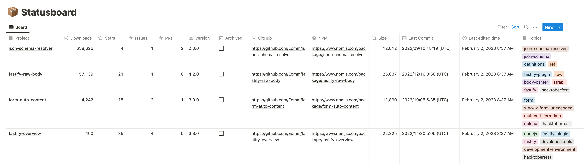
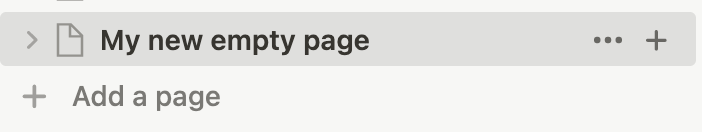
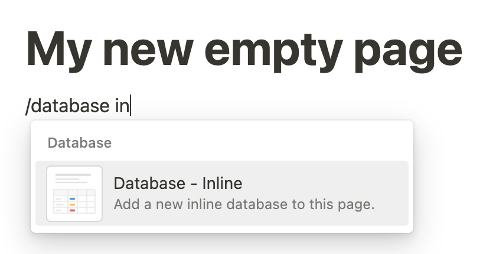
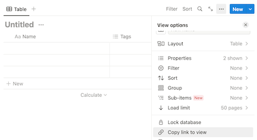

# notion-board

Monitor your Node.js modules and repositories from a [Notion] page!




## How it works

This project is a GitHub Action that exports a set of data gathered from GitHub and NPM to publish it your [Notion].

The collected data are:

- GitHub repository name
- NPM downloads per month
- GitHub stars
- GitHub topics
- Number of open issues, optionally filtered by labels
- Number of open pull requests
- Latest version published on NPM
- Checkbox to mark archived repositories
- Direct link to the repository
- Direct link to the NPM page
- NPM package size in bytes
- Last commit date
- Last edited date

Here is a sample [database template] it will be used to store the data.

> **Note**  
> The project is still in early development and the data exported are not yet customizable nor configurable.  
> I aim to make this application available from the [Notion Connections](https://www.notion.so/integrations/all) marketplace.


### How it works in details

This GitHub Action will:

- Create all the missing columns into the Notion database
- Fetch the list of repositories from GitHub using the provided `github-repository-query` input. You can test the query on [GitHub Search]
- For each repository will check if it's a Node.js module and if it's published on NPM collecting additional data
- Read the Notion database and update the existing rows or create new ones

#### Known behaviors

- Unrecognized rows will be **deleted**
- Unrecognized columns will be **untouched**
- If the row's data is not changed, the row will not be updated to minimize the API calls


## Usage

To install this GitHub Action, you need to create a new GitHub repository and add a `.github/workflows/notion-board.yml` file with the following content:

```yml
name: Notion Board

on:
  workflow_dispatch: # Allow manual trigger to force the update
  schedule:
    - cron: "0 12 * * *" # Sync it "Everyday at 12:00 UTC (5:00 PT)" https://crontab.guru/#0_12_*_*_*

jobs:
  update-notion-board:
    runs-on: ubuntu-latest

    steps:
      - name: Update Notion
        uses: Eomm/notion-board@v0
        with:
          github-repository-query: user:Eomm is:public # Replace with your query eg: "org:fastify"
          notion-token: ${{ secrets.NOTION_TOKEN }}
          notion-database-id: ${{ secrets.NOTION_DATABASE_ID }}
```


### How to configure Notion

In order to use this GitHub Action, you need to create:

1. A notion integration token to allow the GitHub Action to update the database
2. An empty notion database to store the data

#### Create the Notion API token

To get the token, you must follow the [official Notion documentation][1] to create the required resources.  
Note that you must add the following `Capabilities` to the integration:

- _Read content_: to read the database and skip the unchanged rows
- _Update content_: to update existing rows, minimizing the payload
- _Insert content_: to insert new rows

#### Create the Notion database

To create the database, you can follow the [official Notion documentation][2] or follow this quick guide:

Step | Description
--- | ---
 | Create an empty page
 | Create an empty inline database
 | Add to the page, the connection you created to get the API token
 | Share the database link to get a link that [contains the ID][3]
Last step | Add the database ID to the GitHub Action secrets

> **Info**  
> The Action will add to the database all the necessary columns.
> If you rename the columns or change the column's type, the columns will be added again.
> So, **right now you can't change the columns' name** or type.


## Inputs

| Input | Description | Required | Default |
| --- | --- | --- | --- |
| `github-repository-query` | The GitHub repository query to fetch the repositories to monitor. You can test the query on [GitHub Search] | Yes | |
| `github-issue-labels`     | Filter the issues counter by labels. Example: `good first issue` | No | |
| `notion-token`            | The Notion API key to use to update the database | Yes | |
| `notion-database-id`      | The Notion database ID to update | Yes | |
| `github-token`            | The GitHub token to use to fetch the repositories | No | `${{github.token}}` |
| `log-level`               | The log level to use | No | `info` |


## License

Copyright [Manuel Spigolon](https://github.com/Eomm), Licensed under [MIT](./LICENSE).


  [1]: https://developers.notion.com/docs/create-a-notion-integration#step-1-create-an-integration
  [2]: https://developers.notion.com/docs/create-a-notion-integration#step-2-share-a-database-with-your-integration
  [3]: https://developers.notion.com/docs/create-a-notion-integration#step-3-save-the-database-id
  [database template]: https://eomm.notion.site/repository-name-259756cfa17b4ec18f2a9d3e6f66c562
  [Notion]: https://www.notion.so/
  [GitHub Search]: https://github.com/search/
